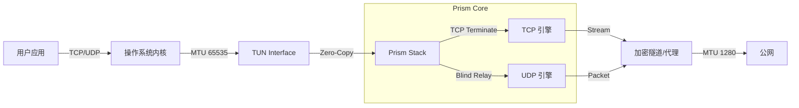

# Prism

### High-Performance User-Space Network Stack in Rust

> "Prism doesn't just forward packets; it reshapes them for speed and stability."

## 📖 About Prism (项目简介)

Prism (棱镜) 是一个基于 Rust 构建的高性能、异步、用户态网络协议栈 (User-Space Network Stack)。

它专为现代 VPN、代理工具和游戏加速器设计，旨在解决传统 TUN/TAP 方案中的性能瓶颈（如 TCP Meltdown 和系统调用开销）。Prism 通过在用户态终结 TCP 连接，将复杂的网络流量转化为纯净的数据流，在保证极致吞吐量的同时，提供 100% 的网络兼容性。

## 🚀 核心特性 (Key Features)

### 1. 极致性能 (Extreme Performance)

- **Software GSO (软件分段卸载)**: 突破 1500 MTU 限制。Prism 采用 Jumbo Frames (MTU 65535) 技术，让操作系统一次性传递 64KB 大包，将系统调用 (Syscall) 开销降低 40 倍，单核即可跑满万兆 (10Gbps) 物理带宽。

- **Zero-Copy & Zero-Allocation**: 全链路零拷贝设计。利用 `bytes::Bytes` 和对象池 (Object Pooling) 技术，在 RX/TX 路径上实现了真正的 **零内存分配**，消除了高并发下的 GC 压力和内存抖动。

- **Async Runtime**: 基于 tokio 和 smoltcp 的全异步架构，轻松应对数万并发连接 (C10K+)。

### 2. 智能连接管理 (Smart Connectivity)

- **TCP 终结 (Termination)**: 在本地终结 TCP 连接，彻底根治 "TCP-in-TCP" 导致的性能崩溃问题。

- **双模式握手 (Dual-Mode Handshake)**:
    - ⚡️ **Fast Mode (0-RTT)**: 秒开模式。拦截 SYN 并立即回复，极大降低 Web 浏览延迟。
    - 🤝 **Consistent Mode**: 真实模式。等待远端隧道建立后再回复，完美通过 TCPing 探测，适用于游戏和对延迟敏感的应用。

- **Blind Relay**: 对 UDP/ICMP 流量采用极速盲转发策略，在保持高性能的同时兼容各类非 TCP 协议。

### 3. 工业级稳定性 (Industrial Reliability)

- **双 MTU 架构 (Dual MTU Architecture)**:
    - **Ingress**: 65535 (为了性能，欺骗内核)。
    - **Egress**: 1280/1420 (为了兼容，适应公网)。
    - Prism 内置智能的 MSS Clamping 和 UDP 分片检测，确保在任何糟糕的网络环境下（如校园网、4G/5G）都能保持 100% 连通，永不丢包。

- **Rust Safety**: 受益于 Rust 的所有权机制，Prism 在设计上杜绝了空指针和数据竞争，提供内存安全的运行时保障。

## 🛠 架构原理 (Architecture)

Prism 位于操作系统 TUN 设备与用户应用之间，充当智能网关的角色：



## ⚙️ Configuration (配置指南)

Prism 提供了灵活的配置体系，分为 **运行时配置**、**启动参数** 和 **编译期常量** 三个层级。

### 1. 运行时配置 (Runtime Config)

通过 `PrismConfig` 结构体传递给协议栈，支持动态调整策略。

| 配置项 | 类型 | 默认值 | 说明 |
| :--- | :--- | :--- | :--- |
| `egress_mtu` | usize | 1280 | **出口 MTU / 路径 MTU**。<br>决定了 UDP 包的最大限制和 TCP MSS 的计算基准。这是兼容性的核心。<br>推荐值：1280 (绝对安全) 或 1420 (一般宽带)。 |
| `handshake_mode` | Enum | Fast | **握手模式**。<br>• **Fast**: 0-RTT 抢答，秒开网页，适合浏览器。<br>• **Consistent**: 同步模式，保留真实 RTT，适合游戏和 VoIP。 |

### 2. 启动参数 (Startup Config)

在创建 TUN 设备时设置，决定了物理层面的性能上限。

| 参数 | 建议值 | 说明 |
| :--- | :--- | :--- |
| **TUN MTU** | 65535 | **入口 MTU**。<br>强烈建议设为 65535 以开启 Software GSO (性能模式)。<br>如果设为 1500，则退化为普通 VPN 模式。 |
| **IP Address** | 10.11.12.1 | 虚拟网关 IP。默认使用该私有地址段，防止与常见路由冲突。 |

### 3. 核心常量 (Internal Constants)

位于 `src/constants.rs` 和 `src/stack.rs`，用于深度性能调优。

| 常量名 | 当前值 | 说明 |
| :--- | :--- | :--- |
| `TCP_RX_BUFFER_SIZE` | 2MB | 单个 TCP 连接的接收缓冲区。超大缓冲是为了适配 10Gbps 高带宽延迟积 (BDP)。 |
| `TCP_TX_BUFFER_SIZE` | 2MB | 单个 TCP 连接的发送缓冲区。 |
| `BATCH_SIZE` | 64 | epoll/kqueue 每次唤醒最大处理包数，用于减少上下文切换。 |
| `CHANNEL_SIZE` | 8192 | 内部 mpsc 通道的队列深度。 |
| `TX_POOL_MAX_SIZE` | 128 | TX 缓冲池最大容量，防止极端负载下内存无限增长。 |
| `DEFAULT_MSS_CLAMP` | 1280 | 出口路径 MSS 钳制默认值，确保公网兼容性。 |

## 🎯 适用场景 (Use Cases)

- **高性能 VPN 客户端**: 需要跑满千兆/万兆带宽的场景。
- **游戏加速器**: 需要精确控制 TCP 握手时序和 UDP 转发逻辑。
- **物联网 (IoT) 网关**: 资源受限但需要高效网络处理的嵌入式设备。

## 📦 Installation

```toml
[dependencies]
prism = { path = "../prism" } # Local path or git
```

## ⚖️ License

MIT License
