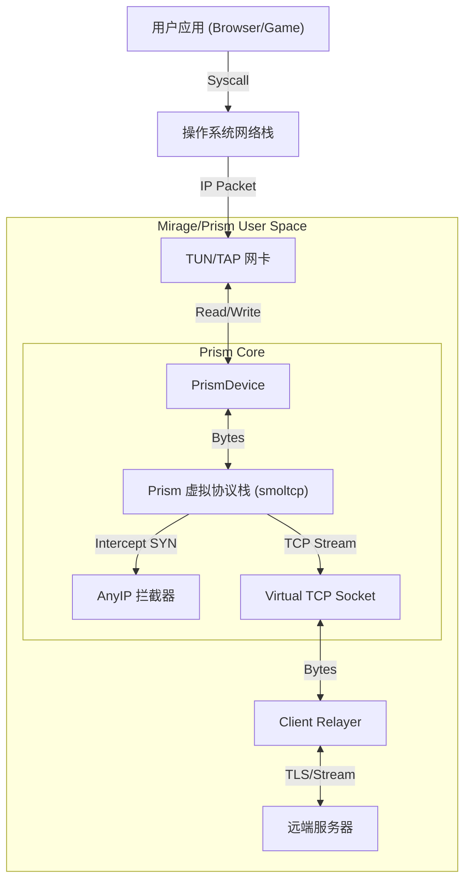

# Prism 网络协议栈开发路线图 (Roadmap)

本文档详细记录了 `prism` 核心库的开发进度、架构设计及后续演进计划。

## 📍 1. 项目概述 (Overview)

**Prism** 是 Mirage VPN 项目的核心网络引擎，基于 Rust 和 `smoltcp` 构建的高性能用户态网络协议栈。
它的核心目标是：
1.  **TCP Meltdown 终结者**: 通过在用户态终结 TCP 连接，将 VPN 流量转化为纯净的数据流，彻底解决 TCP-in-TCP 性能崩溃问题。
2.  **通用 L3/L2 支持**: 同时支持 IP层 (TUN) 和 以太网层 (TAP) 接入，适配各种复杂网络环境。
3.  **零拷贝 (Zero-Copy)**: 利用 Rust 的所有权机制和 `bytes` crate，实现内存安全的高效数据转发。

---

## ✅ 2. 已完成 (Completed Phases)

### Phase 1: 核心剥离与重构 (Extraction)
- [x] **独立 Crate**: 创建 `prism` 为独立 workspace member，解耦 `mirage` 业务逻辑。
- [x] **PrismDevice**: 实现了通用的 PHY 适配层，支持 `tokio` 异步通道 (`mpsc`) 与 `smoltcp` 同步接口的桥接。
- [x] **PrismStack**: 移植并重构了原 `VirtualStack`，作为协议栈的主控中心。
- [x] **PrismTrap**: 实现了高性能的 TCP SYN 拦截器 (AnyIP)，用于按需创建虚拟连接。

### Phase 2: 握手与连接管理 (Handshake Strategy)
- [x] **Fast Mode (抢答模式)**: 收到 SYN 立即回复 SYN-ACK (0-RTT)，适合 Web 浏览。
- [x] **Consistent Mode (同步模式)**: 收到 SYN 后挂起，等待远程隧道建立成功后再回复 SYN-ACK，保留真实 RTT，适合游戏/VoIP。
- [x] **Tunnel Request API**: 定义了清晰的 `TunnelRequest` 接口，允许上层 (Relayer) 动态处理连接请求。

### Phase 3: 内存优化 (Memory Optimization)
- [x] **Phase 6.1 (Clone Safety)**: 初步实现，确保多线程数据传递的安全性。
- [x] **Phase 6.2 (Bytes Refactor)**: 全面引入 `bytes::Bytes` crate。
    - [x] 将所有 `Vec<u8>` 通道替换为 `Bytes`，支持 O(1) 克隆和切片。
    - [x] 优化 `PrismDevice` 的 RX/TX 队列处理。
    - [x] 优化 `mirage-client` 的转发层 (`ClientRelayer`)。
    - [x] **成果**: 实现了 "Safe Zero-Copy"，在 Prism 内部管道中消除了不必要的内存分配。

---

## 🚧 3. 进行中 / 待办 (In Progress & Todo)

### Phase 4: L2 以太网支持 (Ethernet / TAP) 🔴
**目标**: 支持 TAP 模式，允许 Mirage 处理 ARP 请求和非 IP 流量，实现真正的二层虚拟网络。

- [ ] **TAP 设备适配**:
    - [x] `PrismDevice` 已支持 `Medium::Ethernet` 枚举。
    - [x] **平台验证**: macOS 原生 `utun` 仅支持 L3 (TUN)。L2 (TAP) 需要第三方 kext (已废弃)。**结论: macOS 仅支持 L3，L2 功能主要针对 Linux/Windows。**
    - [ ] Linux/Windows TAP 创建测试 (需对应环境)。
- [ ] **ARP 响应 (ARP Responder)**:
    - [ ] 在 `PrismStack` 中启用 `smoltcp` 的 ARP 功能 (`NeighborCache`)。
    - [ ] 实现虚拟网关 ARP 响应 (如 10.0.0.1 对应的虚拟 MAC)。
- [ ] **L2 转发逻辑**:
    - [ ] 识别以太网帧头 (Ethernet II)。
    - [ ] 提取 IP 包进行 TCP/UDP 处理 (同 L3 逻辑)。
    - [ ] 对非 IP 流量 (如 ARP) 进行本地响应或广播处理。

### Phase 5: 深度性能调优 (Advanced Performance) 🟢
**目标**: 将吞吐量推向物理极限 (1Gbps -> 10Gbps)。

- [x] **基础调优**:
    - [x] **Event-Driven Polling**: 重构 `PrismStack::run`，引入 `tokio::select!`。
    - [x] **Batch Processing**: 实现批量读取 (Max 64 pkts)。
    - [x] **Buffer Tuning**: `smoltcp` 缓冲区调整为 2MB+。

- [x] **Software GSO (软件分段卸载) 路线图** 🆕:
    *核心策略*: 通过 **Jumbo Frames (巨型帧)** 模拟 GSO，减少系统调用 (Syscall) 开销，实现跨平台 10Gbps 吞吐。
    
    - [x] **Step 1: 跨平台 Jumbo Frames (High MTU)**
        - [x] 将 TUN MTU 设置为 **65535** (macOS/Linux/Windows 通用)。
        - [x] 调整 `PrismDevice` 读取缓冲区至 **64KB+**，防止大包截断。
        - [x] **预期**: 减少 90%+ 的 `read/write` 系统调用，PPS 降低 40 倍。
    
    - [x] **Step 2: 协议栈适配 (Stack Tuning)**
        - [x] 配置 `smoltcp` 接受 **无限大 MSS** (或 65535)，允许处理超大 TCP 段。
        - [x] 确保 Window Scaling 开启，以支持高带宽延迟积 (BDP)。
    
    - [x] **Step 3: MSS Clamping (关键)**
        - [x] **问题**: 本地 MTU 65535，但公网仅支持 1500。直接转发会导致路径黑洞。
        - [x] **解决**: 在 `PrismTrap` 拦截 SYN 包时，强制修改 MSS 选项 (如改为 1280)。
        - [x] **效果**: 浏览器(本地) <-> Prism 走 Jumbo Frame (高速)；Prism <-> 公网 走标准包 (兼容)。

    - [x] **Step 4: Linux Native GSO (可选/进阶)**
        - [x] 开启 `IFF_VNET_HDR` 标志 (仅 Linux)。
        - [x] 在读写时处理 `virtio_net_hdr` 头部。
        - [x] **收益**: 利用内核硬件卸载计算 Checksum，进一步降低 CPU 占用。

### Phase 6: 协议扩展 (Universal Protocol Support) 🟢
**核心策略**: **TCP 必须拦截** (为了性能和抗 Meltdown)，**其他协议统一切换为纯盲转发 (Blind Relay)**。

- [x] **Blind Relay 机制 (UDP/ICMP/GRE/ESP)**:
    - [x] **实现原理**: 对于非 TCP 流量，直接封装 IP 包转发，不在用户态维护连接状态。
    - [x] **TCP**: 继续保持通过 PrismStack 拦截与终结，确保极致性能。
    - [x] **其他协议**: 通过 Blind Relay 通道 (UDP Tunnel) 直接透传，支持 Ping, DNS (UDP), QUIC 等。

---

## 4. 架构图 (Architecture)

## 5. 常见问题 (FAQ)

**Q: 为什么需要 Consistent Handshake (同步握手)?**
A: 为了欺骗 TCPing 和游戏客户端。如果使用 Fast Mode (0-RTT)，所有连接看起来都是 <1ms 延迟，这会导致客户端误判网络质量，且无法通过 TCPing 探测真实服务器存活。同步握手确保了"只有这一头通了，我才告诉你通了"。

**Q: Zero-Copy 是真的零拷贝吗?**
A: 在 Rust 生态中，真正的“零拷贝”通常指从内核直接 DMA 到用户态 (io_uring/AF_XDP)。Prism 目前实现的是 **Safe Zero-Copy + Zero-Allocation**：
1. **Zero-Copy (数据无搬运)**:
    - 内核 -> 用户态 (1次拷贝，标准 socket API 限制)。
    - 用户态内部传递 (PrismDevice -> Stack -> Relayer -> TLS) -> **0 拷贝** (全链路引用计数 `Bytes`)。
2. **Zero-Allocation (内存无分配)**:
    - **RX**: 使用 Smart Batching 策略，复用大块堆内存 (1MB)，通过切片 (`split_to`) 产生数据包，消除 `malloc` 开销。
    - **TX**: 使用 Arena Buffer Pool，复用大块内存 (64KB)，通过切片发送，剩余容量回收利用。
    - **No Memset**: 使用 `unsafe set_len` 避免了高频的内存清零操作。

这是目前标准 socket API 下的最优解，在 macOS 上实现了 2.4Gbps+ 的吞吐量。
